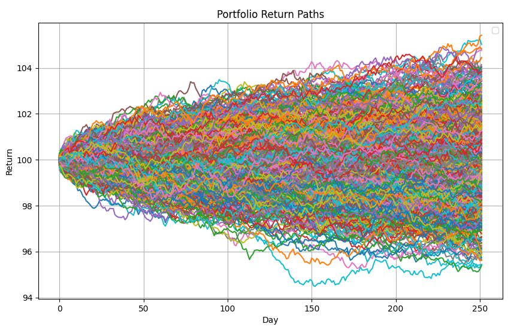

# Portfolio Risk Manager

A high-performance C++ application for portfolio risk analysis and Monte Carlo simulation, featuring multi-threaded computation and comprehensive risk metrics calculation.

## Features

- **Portfolio Construction**: Build portfolios with custom asset allocations
- **Risk Metrics**: Calculate VaR, CVaR, Sharpe ratio, volatility, and return statistics
- **Monte Carlo Simulation**: Multi-threaded Monte Carlo engine for path generation
- **Historical Data Analysis**: Automatic asset data downloading and processing
- **Performance Optimized**: Aggressive compiler optimizations for maximum performance

## Prerequisites

- **C++ Compiler**: GCC 10+ or Clang 12+ with C++23 support
- **CMake**: Version 3.20 or higher
- **Python 3.8+**: For asset data downloading
- **LLDB**: For debugging (optional)

## Installation

1. **Clone the repository**:
   ```bash
   git clone https://github.com/ydusf/Portfolio-Risk-Manager.git
   cd PortfolioRiskManager
   ```

2. **Set up Python environment**:
   ```bash
   python3 -m venv venv
   source venv/bin/activate
   pip3 install -r scripts/requirements.txt
   ```

3. **Build the project**:
   ```bash
   chmod +x run.sh
   ./run.sh NVDA=0.4 GOOGL=0.3 MSFT=0.3
   ```

## Usage

### Basic Portfolio Analysis

Run the application with ticker symbols and their respective weights:

```bash
./run.sh NVDA=0.15 GOOGL=0.1 AGYS=0.08 AMZN=0.03 MU=0.06 MSFT=0.03 NU=0.04 LLY=0.085 UNH=0.2 NVO=0.225
```

The application will:
1. Download historical price data for the specified assets
2. Normalize portfolio weights to sum to 100%
3. Calculate comprehensive risk metrics
4. Run Monte Carlo simulations

### Example Output

```
Parsed tickers and normalized weights:
  NVDA -> 15.000%
  GOOGL -> 10.000%
  ...

Portfolio Risk Metrics:
  Mean 10-Day Return: 2.45%
  Volatility (STD):   1.23%
  Value-at-Risk (VaR): 3.21%
  Conditional VaR:     4.56%
  Sharpe Ratio:        1.85

Monte Carlo Simulation:
  Runs: 1,000,000
  Time taken: 650 ms
```

## Build Configurations

### Release Build (Default)
```bash
./run.sh TICKER=WEIGHT [...]
```
Features aggressive optimizations including:
- Link-time optimization (LTO)
- Native CPU architecture targeting
- Loop optimizations and vectorization
- Fast math operations

### Debug Build
```bash
./debug.sh TICKER=WEIGHT [...]
```
Includes debugging symbols and runs with LLDB for development.

### Testing
```bash
./test.sh
```
Runs the GoogleTest suite with comprehensive unit tests.

## Architecture

### Core Components

- **Portfolio**: Manages asset allocations and return series calculation
- **MonteCarloEngine**: Multi-threaded simulation engine for path generation
- **DataHandler**: CSV parsing and historical data processing
- **PortfolioUtils**: Risk metrics calculation (VaR, CVaR, Sharpe ratio)
- **RandomGenerator**: Thread-safe random number generation

### Key Classes

```cpp
class Portfolio {
    // Manages tickers, weights, and return calculations
};

class MonteCarloEngine {
    // Multi-threaded Monte Carlo simulations
    // Hardware-accelerated random number generation
};

namespace PortfolioUtils {
    // Risk metrics: VaR, CVaR, Sharpe ratio, volatility
};
```

## Performance Features

- **Multi-threading**: Utilizes all available CPU cores
- **SIMD Optimizations**: Vectorized mathematical operations
- **Memory Efficiency**: Optimized data structures and algorithms
- **Compiler Optimizations**: Aggressive release-mode optimizations

### Performance Benchmarks

Typical performance on M1 Macbook Air:
- 1M Monte Carlo paths: ~500-900ms
- Portfolio risk calculation: <10ms
- Multi-asset data processing: <50ms

## File Structure

```
├── CMakeLists.txt          # Build configuration
├── include/                # Header files
│   ├── Portfolio.hpp
│   ├── MonteCarloEngine.hpp
│   ├── DataHandler.hpp
│   ├── PortfolioUtils.hpp
│   └── ...
├── src/                    # Source files
│   ├── main.cpp
│   ├── Portfolio.cpp
│   ├── MonteCarloEngine.cpp
│   └── ...
├── scripts/                # Python utilities
│   ├── assets.py          # Asset data downloader
│   ├── paths.py           # Visualization tools
│   └── requirements.txt
├── tests/                  # Unit tests
├── assets/                 # Downloaded asset data (auto-generated)
├── run.sh                  # Release build script
├── debug.sh               # Debug build script
└── test.sh                # Test runner
```

## Risk Metrics

### Supported Metrics

- **Value at Risk (VaR)**: Potential loss at 95% confidence level
- **Conditional VaR (CVaR)**: Expected loss beyond VaR threshold
- **Sharpe Ratio**: Risk-adjusted return measure
- **Portfolio Volatility**: Standard deviation of returns
- **Mean Returns**: Daily and multi-day average returns

### Monte Carlo Features

- **Multi-threaded execution**: Scales with CPU cores
- **Configurable parameters**: Path count, time horizon, volatility
- **Path generation**: Geometric Brownian motion modeling
- **Statistical analysis**: Comprehensive return distribution analysis
- **Visualization support**: Generate CSV outputs for plotting (see `scripts/paths.py`)

The application can output simulation results to CSV files for visualization:



*Generated using the `scripts/paths.py` utility to visualize portfolio return paths*

## Data Sources

Asset data is automatically downloaded from Yahoo Finance via the `yfinance` Python library. Data includes:
- Historical closing prices
- Configurable date ranges
- Automatic CSV formatting
- Error handling for missing data

## Advanced Usage

### Custom Time Horizons
Modify the Monte Carlo simulation parameters in `MonteCarloEngine::GenerateReturns()`:
```cpp
Returns returns = mce.GenerateReturns(
    portfolioMean,    // Drift
    portfolioStd,     // Volatility
    1000000,          // Number of paths
    252               // Days (default: 1 year)
);
```

### Profile-Guided Optimization
Enable PGO for maximum performance:
```bash
cmake -DUSE_PGO=ON -DCMAKE_BUILD_TYPE=Release ..
```

## Contributing

1. Fork the repository
2. Create a feature branch
3. Add comprehensive tests
4. Ensure all tests pass: `./test.sh`
5. Submit a pull request

## License

No license at the moment

## Performance Tips

1. **Use Release builds** for production analysis
2. **Enable native optimizations** (automatically configured)
3. **Run on systems with multiple CPU cores** for best Monte Carlo performance
4. **Ensure sufficient RAM** for large-scale simulations (>1M paths)

## Troubleshooting

### Common Issues

- **Build failures**: Ensure C++23 compiler support
- **Python errors**: Verify virtual environment activation
- **Data download issues**: Check internet connectivity and ticker symbols
- **Performance issues**: Use Release build configuration

### Debug Mode

Use the debug script for development:
```bash
./debug.sh TICKER=WEIGHT [...]
```

This launches the application in LLDB with debug symbols for troubleshooting.