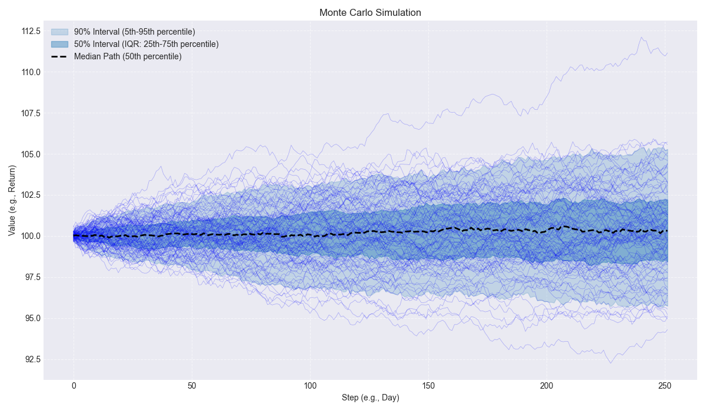
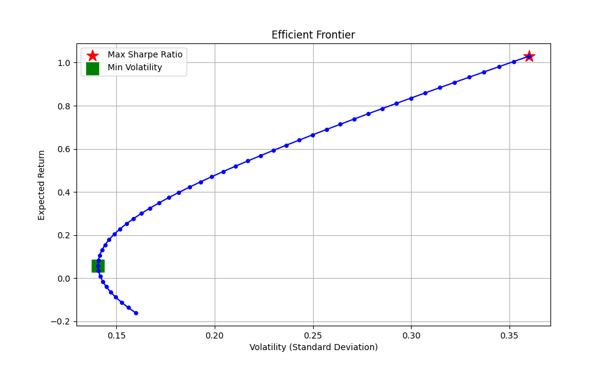

-----

# Portfolio Risk Manager

## Analysis Visualizations


*Monte Carlo simulation paths plotted with `scripts/paths.py`*


*Efficient Frontier plotted with `scripts/frontier.py`*

-----

## Install

Run these commands in your terminal one by one:

```bash
git clone https://github.com/ydusf/Portfolio-Risk-Manager.git
cd Portfolio-Risk-Manager
python3 -m venv venv
source venv/bin/activate
pip3 install -r scripts/requirements.txt
```

-----

## Get API Key

1.  In Trading 212, go to **Settings \> API (Beta)**.
2.  Click **Generate API key**.
3.  Give it a name.
4.  **Permissions**: Select all *except* "Orders Execute" and "Pies Write".
5.  **IP Access**: Select "Restricted access to trusted IPs only".
6.  Go to `whatismyipaddress.com`, get your IPv4 address, and paste it into the box.
7.  Click **Generate API Key** and copy both keys shown.

-----

## Configure

In the `Portfolio-Risk-Manager` folder, create a new file named `.env`

Open the file and add your two keys, replacing the placeholders:

```
TRADING212_API_KEY="YOUR_API_KEY_HERE"
TRADING212_SECRET_KEY="YOUR_SECRET_KEY_HERE"
```

-----

## Run

Run these commands one by one. The first command fetches your live portfolio, the second runs all C++ analysis, and the last two generate the plots.

```bash
python3 scripts/trading212.py
./run.sh
python3 scripts/paths.py data/multi_assets_paths.csv
python3 scripts/frontier.py
```

-----

## Troubleshooting

If you get a "Permission denied" error on the `./run.sh` command, run this command to make the file executable:

```bash
chmod 755 ./run.sh
```

Then, run the main application again:

```bash
./run.sh
```